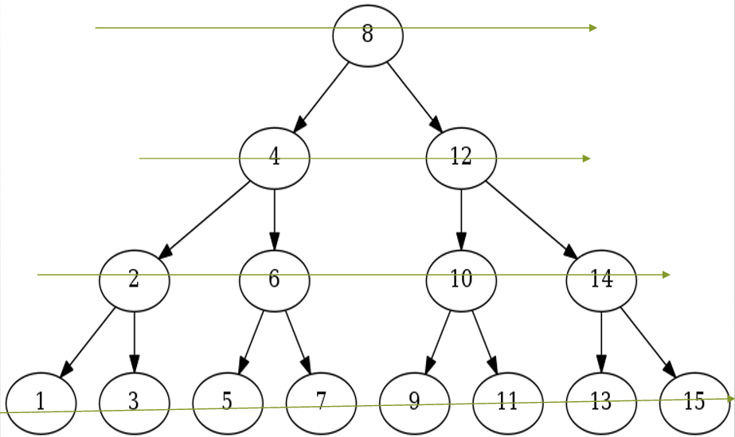

# BREADTH FIRST SEARCH 

## What is Breadth First Search?
Breadth-first search (BFS) is a graph traversal algorithm that explores a graph level by level.
Starting from a selected node, it explores all the neighboring nodes at the current depth before moving on to the nodes at the next depth level.
This ensures that it visits all nodes at a given depth before moving deeper into the graph.
BFS is often used to find the shortest path between two nodes in an unweighted graph, among other applications.

## Breadth First Search Algorithm
 * Step 1: Start with a node (usually the root node).
 * Step 2: Explore all neighbors of the current node.
 * Step 3: Enqueue unvisited neighbors into a queue.

 
 
 * Step 4: Dequeue the current node and repeat steps 2 and 3 for its unvisited neighbors.
 * Step 5: Mark visited nodes to avoid revisiting.
 * Step 6: Continue until the queue is empty.

 ### Applications of Breadth First Search
 * Shortest path finding.
 * Network analysis.
 * Web crawling.
 * Social network analysis.
 * Visual: Icons or images representing different applications of BFS.

 ### Advantages of BFS
 * BFS will never get trapped exploring the useful path forever.
 * If there is a solution, BFS will definitely find it.
 * If there is more than one solution then BFS can find the minimal one that requires less number of steps.
 * Low storage requirement – linear with depth.
 * Easily programmable.

 ### Limitations of BFS
 * High Memory Usage:BFS needs to keep track of all explored and unexplored nodes,potentially leading to high memory consumption especially in large graphs.
 * Slow for Deep Solutions:BFS explores all nodes at each level before moving to the next, making it slow for finding solutions deeper in the search space.
 * Sub-optimal Solutions:BFS prioritizes finding any solution quickly not necessarily the shortest or most optimal one.
 * Limited Backtracking: BFS doesn't backtrack easily, making it difficult to explore alternative paths if the initial exploration doesn't lead to the desired outcome.This can be an issue for problems requiring flexible search strategies.

 > By- _Ajay Pratap_
